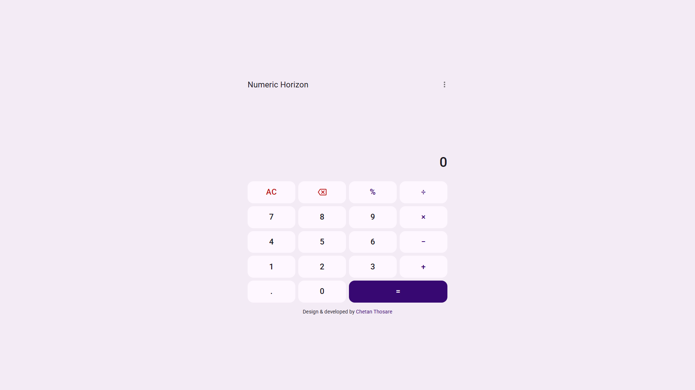

# Numeric Horizon

A modern scientific calculator built with React, TypeScript, and MUI.



## Features

- Beautiful, minimalist calculator UI using Material UI (MUI)
- Keyboard-friendly: full support for physical key input
- Responsive layout for desktop and mobile
- Built-in themes: light, dark, and system-based
- PWA support, install on your device
- Subtle haptics and vibration feedback on supported devices

## Getting started locally

Follow these steps to **clone**, **install**, and **run** the **Numeric Horizon** project on your machine.

### 1. Clone the repository

First, clone the project using Git:

```bash
git clone https://github.com/chetan-speck/numeric-horizon.git
```

Then navigate into the project directory:

```bash
cd numeric-horizon
```

### 2. Install dependencies

Make sure you have **Node.js ≥ v22** installed. Then install the project dependencies:

```bash
npm install
```

### 3. Run in development mode

Start the development server:

```bash
npm run dev
```

This will launch the app at:

[http://localhost:5173](http://localhost:5173)

Open the URL in your browser. The app supports **hot-reloading**, so changes reflect instantly.

### 4. Build for production

To build a production-optimized version:

```bash
npm run build
```

Preview the production build locally:

```bash
npm run preview
```

Then open:

[http://localhost:4173](http://localhost:4173)

### 5. Optional – PWA install (offline support)

After building, the app is a **Progressive Web App (PWA)**. You can:

- Install it from desktop or Android (Chrome/Edge)
- Use it offline
- Pin it to your home screen or desktop

## Requirements

Certainly! Here's the completed section with extra setup tips and system verification steps for your `README.md` or documentation:

## Prerequisites

Make sure you have the following installed and configured before running the project locally:

- [Node.js](https://nodejs.org/en/) - Version 18 or newer recommended
- [npm](https://www.npmjs.com/) - comes with Node.js _(or use `yarn` / `pnpm` if preferred)_
- [Git](https://git-scm.com/) - for cloning the repository and version control
- A modern browser like:
  - [Google Chrome](https://www.google.com/chrome/)
  - [Microsoft Edge](https://www.microsoft.com/edge)
  - [Mozilla Firefox](https://www.mozilla.org/firefox/)

    _(PWA install support works best in Chrome-based browsers)_
